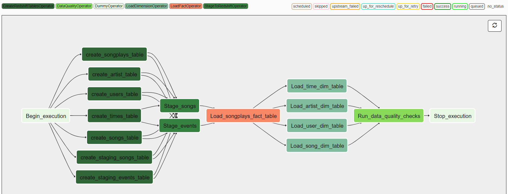
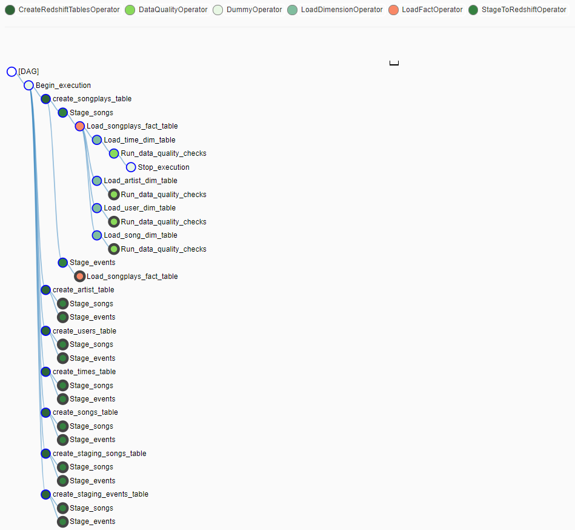

[![LinkedIn][linkedin-shield]][linkedin-url]

<!-- PROJECT LOGO -->
 

  <h3 align="center">Sparkify Data Pipeline using Apache Airflow</h3>

  

    Create Data Pipeline from Sparkify datasets using Apache Airflow.
     
     
    <a href="https://github.com/BankNatchapol/Sparkify-Airflow-Data-Pipeline/issues">Report Bug</a>
    ·
    <a href="https://github.com/BankNatchapol/Sparkify-Airflow-Data-Pipeline/issues">Request Feature</a>
  

<!-- TABLE OF CONTENTS -->

  
Table of Contents

  <ol>
    <li>
      <a href="#about-the-project">About The Project</a>
    </li>
    <li>
      <a href="#pipeline-workflow">Pipeline Workflow</a>
    </li>
    <li><a href="#dataset">Dataset</a>
        <ul>
        <li><a href="#project-dataset">Project Dataset</a></li>
        <li><a href="#song-dataset">Song Dataset</a></li>
        <li><a href="#log-dataset">Log Dataset</a></li>
      </ul>
    </li>
<li>
      <a href="#data-model">Data Model</a>
    </li>
    
<li>
      <a href="#getting-started">Getting Started</a>
      <ul>
        <li><a href="#installation">Installation</a></li>
        <li><a href="#config-files">Config files</a></li>
        <li><a href="#aws-infrastructures">AWS infrastructures</a></li>
        <li><a href="#variables">Variables</a></li>
        <li><a href="#connections">Connections</a></li>
        <li><a href="#start-server">Start Server</a></li>
      </ul>
    </li>
    <li><a href="#other-files">Other files</a></li>
    <li><a href="#contact">Contact</a></li>
  </ol>

<!-- ABOUT THE PROJECT -->
## About The Project
A music streaming company, Sparkify, has decided that it is time to introduce more automation and monitoring to their data warehouse ETL pipelines and come to the conclusion that the best tool to achieve this is Apache Airflow.

I need to create high grade data pipelines that are dynamic and built from reusable tasks, can be monitored, and allow easy backfills. They have also noted that the data quality plays a big part when analyses are executed on top the data warehouse and want to run tests against their datasets after the ETL steps have been executed to catch any discrepancies in the datasets.

The source data resides in S3 and needs to be processed in Sparkify's data warehouse in Amazon Redshift. The source datasets consist of JSON logs that tell about user activity in the application and JSON metadata about the songs the users listen to.

<!-- PIPELINE WORKFLOW -->
## Pipeline Workflow
Graph view.

Tree view.

In this workflow there are 5 steps.  
1. Create fact and dimension tables in Amazon Redshift.
2. Load data from Amazon S3 into staging tables in Amazon Redshift.
3. Load data from staging tables into fact table.
4. Load data from staging tables into dimension tables.
5. Run data quality checks. 

### DAG Configuration
In the DAG, there 5 requirements.
1. The DAG does not have dependencies on past runs
2. On failure, the task are retried 3 times
3. Retries happen every 5 minutes
4. Catchup is turned off
5. Do not email on retry

<!-- Dataset -->
## Dataset
### Project Dataset
There are two datasets that reside in S3. Here are the S3 links for each: 
Song data:
>s3://udacity-dend/song_data

Log data:
>s3://udacity-dend/log_data

Log data json path:
>s3://udacity-dend/log_json_path.json

### Song Dataset
The first dataset is a subset of real data from the Million Song Dataset. Each file is in JSON format and contains metadata about a song and the artist of that song. The files are partitioned by the first three letters of each song's track ID. For example, here are filepaths to two files in this dataset.
>song_data/A/B/C/TRABCEI128F424C983.json 
>song_data/A/A/B/TRAABJL12903CDCF1A.json

And below is an example of what a single song file, TRAABJL12903CDCF1A.json, looks like.

>{"num_songs": 1, "artist_id": "ARJIE2Y1187B994AB7", "artist_latitude": null, "artist_longitude": null, "artist_location": "", "artist_name": "Line Renaud", "song_id": "SOUPIRU12A6D4FA1E1", "title": "Der Kleine Dompfaff", "duration": 152.92036, "year": 0}

### Log Dataset

The second dataset consists of log files in JSON format generated by this event simulator based on the songs in the dataset above. These simulate activity logs from a music streaming app based on specified configurations.

The log files in the dataset you'll be working with are partitioned by year and month. For example, here are filepaths to two files in this dataset.
>log_data/2018/11/2018-11-12-events.json  
>log_data/2018/11/2018-11-13-events.json

And below is an example of what the data in a log file, 2018-11-12-events.json, looks like.

<!-- DATA MODEL -->
## Data Model
This is my database Star Schema.

<!-- GETTING STARTED -->
## Getting Started

### Installation
install package with
> pip install -r requirements.txt
### Config files
create config files in config folder and replace ? with your values. 
config/config.cfg : 
> [AWS] 
> CONN_ID = aws_credentials_id   &emsp;&emsp;&emsp;&nbsp;&nbsp; //  AWS connection name for using in dag 
> CONN_TYPE = aws   &emsp;&emsp;&emsp;&emsp;&emsp;&emsp;&emsp;&emsp;&nbsp;&nbsp;&nbsp; // Connection type 
> LOGIN = ?   &emsp;&emsp;&emsp;&emsp;&emsp;&emsp;&emsp;&emsp;&emsp;&emsp;&emsp;&emsp;&nbsp;&nbsp; // AWS IAM User access key 
> PASSWORD = ?   &emsp;&emsp;&emsp;&emsp;&emsp;&emsp;&emsp;&emsp;&emsp;&emsp;&nbsp; // AWS IAM User secret access key 
>
> [REDSHIFT] 
> CONN_ID = redshift &emsp;&emsp;&emsp;&emsp;&emsp;&emsp;&emsp;&emsp;&nbsp; //  Redshift connection name for using in dag 
> CONN_TYPE = ? &emsp;&emsp;&emsp;&emsp;&emsp;&emsp;&emsp;&emsp;&emsp;&emsp; //  Connection type 
> DWH_CLUSTER_TYPE = ? &emsp;&emsp;&emsp;&emsp;&emsp;&emsp;&nbsp; //  Redshift cluster type 
> DWH_NUM_NODES = ? &emsp;&emsp;&emsp;&emsp;&emsp;&emsp;&nbsp;&nbsp;&nbsp; //  Number of node using in Redshift cluster 
> DWH_NODE_TYPE = ? &emsp;&emsp;&emsp;&emsp;&emsp;&emsp;&emsp;&nbsp;&nbsp; //  Node type 
> DWH_CLUSTER_IDENTIFIER = ? &emsp;&emsp;&emsp;&nbsp;&nbsp; //  Cluster identifier 
> DB_NAME = ? &emsp;&emsp;&emsp;&emsp;&emsp;&emsp;&emsp;&emsp;&emsp;&emsp;&emsp; //  Redshift database name 
> DB_USER = ? &emsp;&emsp;&emsp;&emsp;&emsp;&emsp;&emsp;&emsp;&emsp;&emsp;&emsp;&nbsp;&nbsp; //  Redshift database username 
> DB_PASSWORD= ? &emsp;&emsp;&emsp;&emsp;&emsp;&emsp;&emsp;&emsp;&emsp; //  Redshift database password 
> DB_PORT = ? &emsp;&emsp;&emsp;&emsp;&emsp;&emsp;&emsp;&emsp;&emsp;&emsp;&emsp;&nbsp;&nbsp; //  Redshift database connection port 
> HOST =  
> 
> [S3] 
> S3_SONG_KEY = ? &emsp;&emsp;&emsp;&emsp;&emsp;&emsp;&emsp;&emsp;&emsp;&nbsp;&nbsp; //  S3 key for song dataset 
> S3_LOG_KEY = ? &emsp;&emsp;&emsp;&emsp;&emsp;&emsp;&emsp;&emsp;&emsp;&emsp;&nbsp;&nbsp; //  S3 key for log dataset 
> S3_BUCKET = ? &emsp;&emsp;&emsp;&emsp;&emsp;&emsp;&emsp;&emsp;&emsp;&emsp;&emsp; //  S3 bucket name  

### AWS infrastructures
creating AWS Redshift cluster.
> python infras/create_infras.py

### Variables
set variables in Apache Airflow.
> python config/set_variables.py

### Connections
set connections in Apache Airflow.
> python config/set_connections.py

### Start Server
run these command to start webserver GUI.
> airflow scheduler -D 
> airflow webserver

<!-- OTHER FILES -->
## Other files
delete all infrastructures on AWS
> python delete_infras.py

<!-- CONTACT -->
## Contact

Facebook - [@Natchapol Patamawisut](https://www.facebook.com/natchapol.patamawisut/)

Project Link: [https://github.com/BankNatchapol/Sparkify-Airflow-Data-Pipeline](https://github.com/BankNatchapol/Sparkify-Airflow-Data-Pipeline)

<!-- MARKDOWN LINKS & IMAGES -->
<!-- https://www.markdownguide.org/basic-syntax/#reference-style-links -->
[linkedin-shield]: https://img.shields.io/badge/-LinkedIn-black.svg?style=for-the-badge&logo=linkedin&colorB=555
[linkedin-url]: https://www.linkedin.com/in/natchapol-patamawisut
